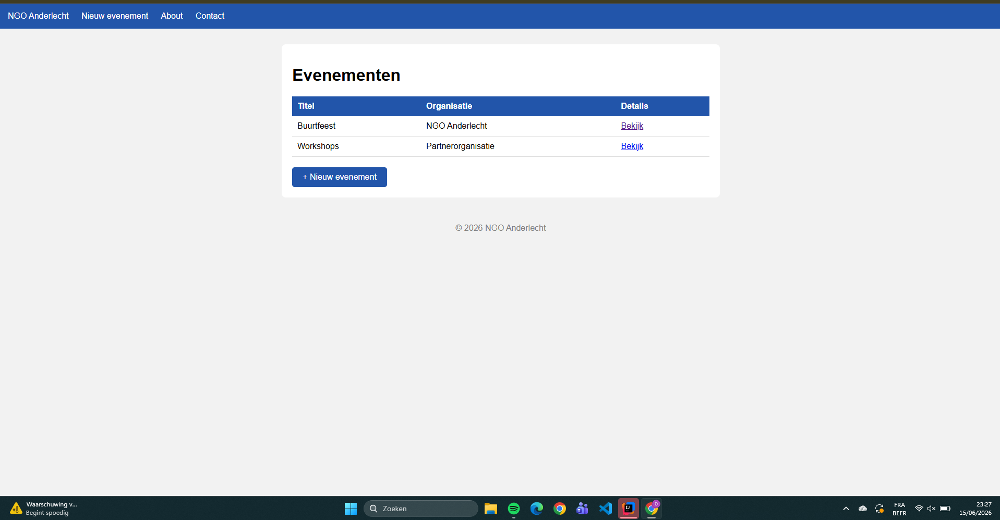
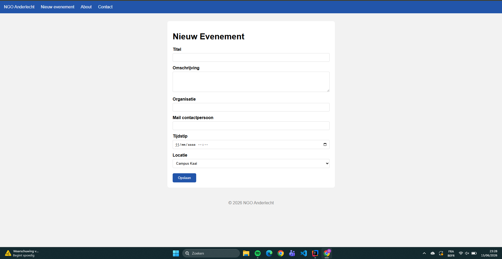
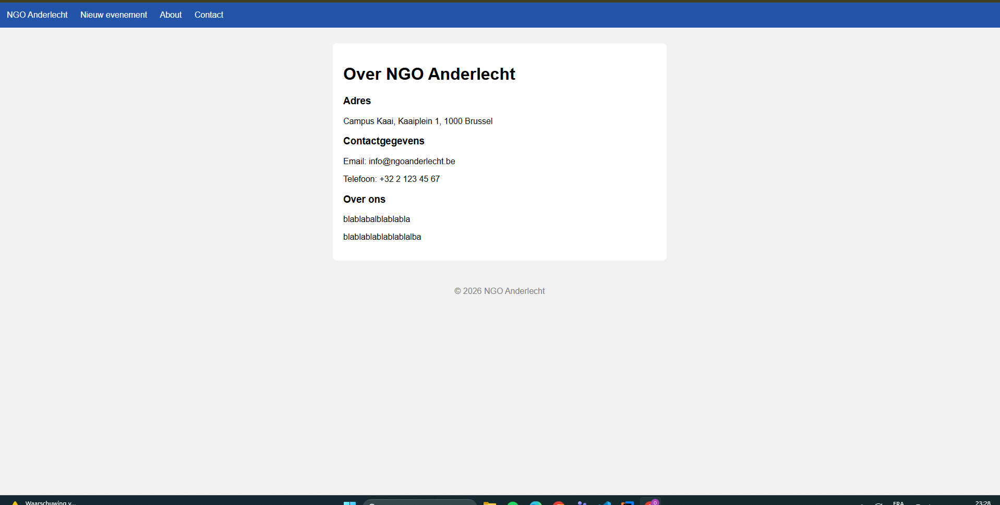
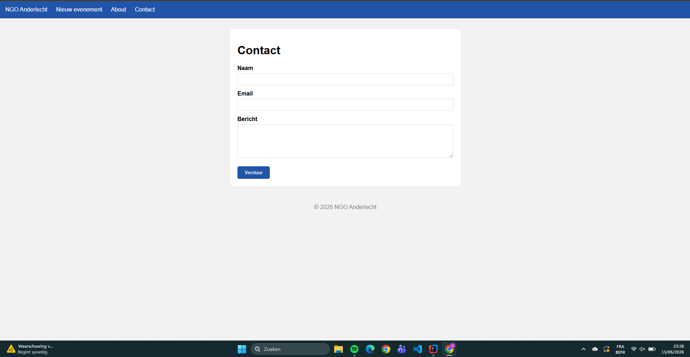
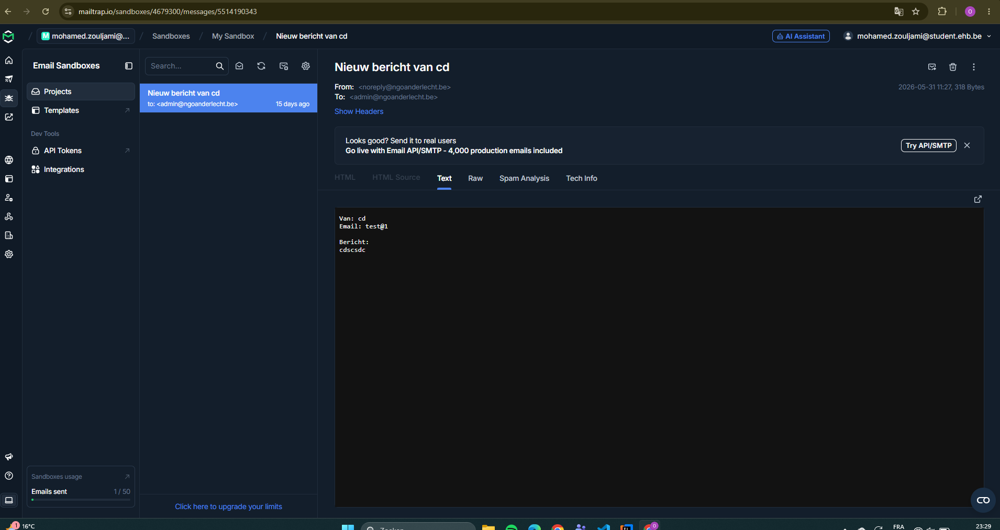

# Enterprise Apps - Mohamed Zouljami

## Beschrijving
Een webapplicatie voor NGO Anderlecht die zich inzet voor gemeenschapsopbouw.
De app beheert evenementen en laat bezoekers contact opnemen via e-mail.

## Gebruikte Libraries en Frameworks
- **Java 20** - Programmeertaal
- **Spring Boot 3.5.14** - Backend framework
- **Thymeleaf** - Template engine voor HTML pagina's
- **Spring Web** - Voor de REST controllers en routing
- **Spring Mail** - Voor het versturen van e-mails
- **Spring Boot DevTools** - Voor automatisch herladen tijdens ontwikkeling
- **Mailtrap.io** - Voor het fictief versturen van e-mails

## Pagina's
- **Index** - Overzicht van de 10 laatste evenementen
- **New** - Formulier om een nieuw evenement toe te voegen
- **Details** - Detailpagina van een specifiek evenement
- **About** - Informatie over NGO Anderlecht
- **Contact** - Contactformulier dat e-mails verstuurt via Mailtrap

## Gebruikte Tutorials en Documentatie
- [Spring Boot Documentatie](https://docs.spring.io/spring-boot/docs/current/reference/html/)
- [Spring MVC Guide](https://spring.io/guides/gs/serving-web-content/)

## AI-chats
Ik heb ai gebruikt om te weten hoe we de mailtrap.io gebruiken.
en ook voor mijn leerstof te beheren om die project te kunnen doen.

## Manual - Project uitvoeren

### Vereisten
- Java 20 geïnstalleerd
- IntelliJ IDEA
- **Maven** - Build tool voor het beheren van dependencies
- **Mailtrap.io** - Voor het fictief versturen van e-mails
- **Spring Mail** - Voor het versturen van e-mails

### Stappen
1. Start het project op via de terminal: ./mvnw spring-boot:run
2. Open je browser en ga naar:
3. http://localhost:8080

## foto's

